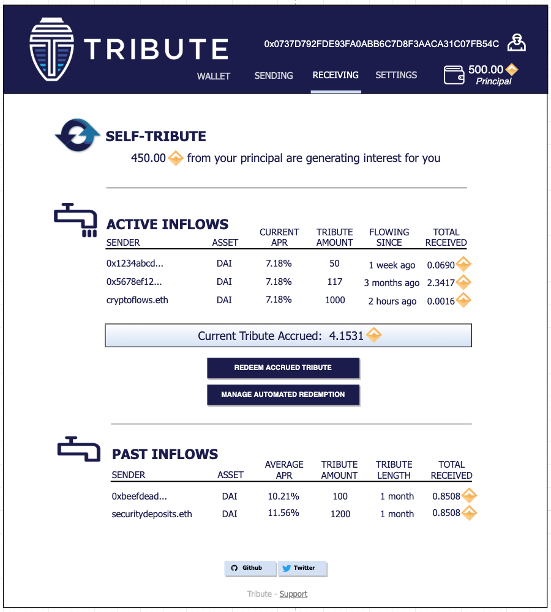

## Overview

Tribute overview.

## Getting Started
### Obtaining Kovan DAI to generate rDAI
*Prerequisites*
* MetaMask Wallet
* Some Kovan ETH --
There is a Kovan ETH faucet at https://faucet.kovan.network/ that allows you to obtain 1 Kovan ETH (KETH) per 24 hours (github login required).  1 KETH should be more than sufficient.
* Some Kovan DAI -- You need Kovan DAI that is compatible with Compound's cDAI.  Once you have KETH, switch to the Kovan network in your wallet.  There is a faucet for the correct Kovan DAI at: https://app.compound.finance/asset/cDAI
You must first click the Enable DAI button and approve the MetaMask transactions, then click the Faucet button on the left, which will initiate a transaction for 100 DAI.  You can use the DAI faucet as many times as you want (and have gas to pay for), though 100 DAI should be fine to experiment with Tribute.

### Tribute-Enabled DAI
Once you have Kovan DAI in your wallet (to see it in MetaMask, add the Custom Token at 0xbF7A7169562078c96f0eC1A8aFD6aE50f12e5A99), navigate to DASHBOARD-WALLET-URL and click the Generate Tribute button.  This will trigger two Metamask transaction popups - one that grants a large allowance for rDAI to transform your Kovan DAI and the second to mint rDAI from your DAI.  At the moment this will effect all of the Kovan DAI in your wallet.  Upon success, you now have Tribute-enabled DAI.  To reverse back to regular DAI, click the Disable Tribute button.  

### Recipient Widget
Recipients can place the Send Tribute widget button on their sites, allowing their users to interact with the Tribute system. 

Clicking the button opens a widget window that can be customized by the recipient to set the relevant Tribute parameters. An example widget for an open source project donation might look something like this.

When a user clicks the Send Tribute button and has Tribute-enabled DAI in his or her wallet, a Metamask transaction will pop up.
### Dashboard

### Tribute Functions
#### Generate Tribute
* calls Kovan DAI contract allowance() method with a 1,000,000 DAI allowance pointed at the rDAI contract
* calls Kovan rDAI mint() method with all the DAI in the user's wallet
#### Disable Tribute
* calls Kovan rDAI redeemAndTransferAll() method
#### Send Tribute
* calls Kovan rDAI createHat() method with new set of recipients and proportions

### Smart Contract Dependencies
#### Kovan Testnet
##### DAI: [0xbF7A7169562078c96f0eC1A8aFD6aE50f12e5A99](https://kovan.etherscan.io/address/0xbF7A7169562078c96f0eC1A8aFD6aE50f12e5A99)
##### cDAI: [0x0a1e4d0b5c71b955c0a5993023fc48ba6e380496](https://kovan.etherscan.io/address/0x0a1e4d0b5c71b955c0a5993023fc48ba6e380496)
##### DaiCompoundAllocationStrategy (latest): [0xb4377efc05bd28be8e6510629538e54eba2d74e3](https://kovan.etherscan.io/address/0xb4377efc05bd28be8e6510629538e54eba2d74e3)
##### rDAI (latest): [0xea718e4602125407fafcb721b7d760ad9652dfe7](https://kovan.etherscan.io/address/0xea718e4602125407fafcb721b7d760ad9652dfe7)
