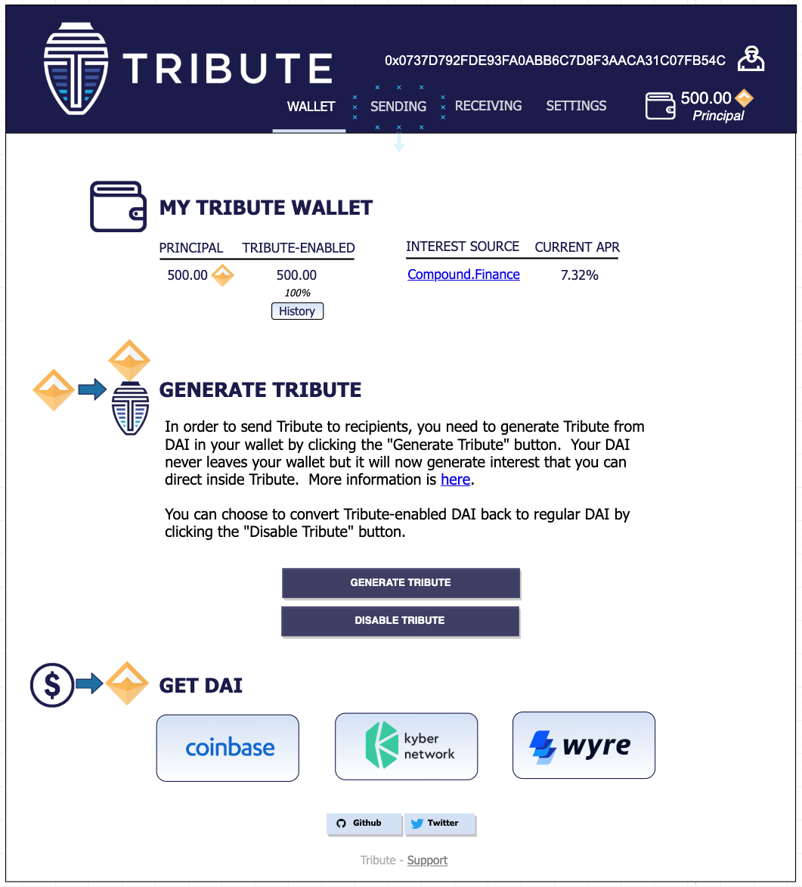

## Overview

Tribute is a user interface abstraction layer that enables users to send portions of the interest generated by their cryptoassets to recipients they wish to support, including charities, open source projects, subscription services and others. It is built on top of the decentralized finance stack of [DAI](https://makerdao.com/en/dai/), [Compound](https://compound.finance) and [rDAI](https://redeem.money), though in the future Tribute will work with other ERC20 tokens and lending platforms.
The Tribute platform is comprised of two basic modules - a widget for recipients to be able to receive Tribute (a portion of the interest generated by a user's cryptoassets) and a dashboard for users to track and manage their Tribute flows.

## Collaboration and Contributions
Tribute is an open source project dedicated to building an infrastructure network to enable the flows of directed interest across the web.  In addition to this repo, contributions and discussions are welcomed at:
* Discourse: [Tribute Forum](https://tributeforum.io)
* Twitter: [@Send_Tribute](https://twitter.com/@Send_Tribute)

## Getting Started
### Obtaining Kovan DAI to generate rDAI
*Prerequisites*
* MetaMask Wallet
* Some Kovan ETH --
There is a Kovan ETH faucet at https://faucet.kovan.network/ that allows you to obtain 1 Kovan ETH (KETH) per 24 hours (github login required).  1 KETH should be more than sufficient.
* Some Kovan DAI -- You need Kovan DAI that is compatible with Compound's cDAI.  Once you have KETH, switch to the Kovan network in your wallet.  There is a faucet for the correct Kovan DAI at: https://app.compound.finance/asset/cDAI
You must first click the Enable DAI button and approve the MetaMask transactions, then click the Faucet button on the left, which will initiate a transaction for 100 DAI.  You can use the DAI faucet as many times as you want (and have gas to pay for), though 100 DAI should be fine to experiment with Tribute.

### Tribute-Enabled DAI
Once you have Kovan DAI in your wallet (to see it in MetaMask, add the Custom Token at 0xbF7A7169562078c96f0eC1A8aFD6aE50f12e5A99), navigate to the Wallet tab on the Dashboard (see image below) and click the Generate Tribute button.  

This will trigger two Metamask transaction popups - one that grants a large allowance for rDAI to transform your Kovan DAI and the second to mint rDAI from your DAI.  At the moment this will effect all of the Kovan DAI in your wallet.  Upon success, you now have Tribute-enabled DAI.  To reverse back to regular DAI, click the Disable Tribute button.  

### Recipient Widget
Recipients can place the Send Tribute widget button on their sites, allowing their users to interact with the Tribute system. 

Clicking the button opens a widget window that can be customized by the recipient to set the relevant Tribute parameters. An example widget for an open source project donation might look something like this.

When a user clicks the Send Tribute button and has Tribute-enabled DAI in his or her wallet, a Metamask transaction will pop up that will redirect the specified portion of the user's Tribute interest.  For example, if a user with 500 available Tribute sent Tribute of 100 DAI to One Click Dapp, the interest on 100 DAI would then flow to One Click Dapp's wallet until the user decided to end that Tribute, while the interest on 400 DAI would continue to flow back to the user.  All 500 DAI remain in the user's wallet - all that moves is the interest generated from that principal.
### Dashboard
The user dashboard has four views:
1. Wallet
2. Sending
3. Receiving
4. Settings
#### Wallet View
The Wallet view is shown and described above.  It allows a user to see what assets in his or her wallet can be used to send Tribute and provides tools for generating and disabling Tribute-enabled DAI.  It also provides links for a user to obtain Tribute-compatible assets like DAI.

#### Sending View
The Sending view allows a user to see where active Tributes are flowing and manage them.  It also contains information on prior Inactive Tributes and has a discovery portal to find additional places to send your Tribute.

Users may obtain additional information about a particular Tribute by clicking the Details button, which will bring up a window looking something like this:

#### Receiving View
The Receiving view allows a user to see what is flowing into his or her wallet as Tribute.  This includes Self-Tribute, which is the cDAI-like interest flowing back to the user from the available (unallocated) Tribute.  
It also shows a user the active inflows of Tribute that are being sent to his or her wallet.  It allows users to see how much Tribute has accrued and they can redeem that Tribute (which will move it into their prinicipal) by clicking the Redeem Tribute button.  We plan to build a tool to program redemptions to occur at predetermined thresholds, such as when the unredeemed Tribute hits 5 DAI and safe gas costs less than 5 gwei.
It also allows users to see information about past Tribute inflows.

#### Settings View
[FORTHCOMING]

### Tribute Functions
#### Generate Tribute
* calls Kovan DAI contract allowance() method with a 1,000,000 DAI allowance pointed at the rDAI contract
* calls Kovan rDAI mint() method with all the DAI in the user's wallet
#### Disable Tribute
* calls Kovan rDAI redeemAndTransferAll() method
#### Send Tribute
* calls Kovan rDAI createHat() method with new set of recipients and proportions
#### End Tribute
* calls Kovan rDAI createHat() method with new set of recipients (omitting the specified recipient) and proportions
* alternately, calls Kovan changeHat() method if the intended recipients and proportions were extant in a previously used hat
#### Redeem Tribute
* calls Kovan rDAI payInterest() method on wallet address

### Smart Contract Dependencies
#### Kovan Testnet
##### DAI: [0xbF7A7169562078c96f0eC1A8aFD6aE50f12e5A99](https://kovan.etherscan.io/address/0xbF7A7169562078c96f0eC1A8aFD6aE50f12e5A99)
##### cDAI: [0x0a1e4d0b5c71b955c0a5993023fc48ba6e380496](https://kovan.etherscan.io/address/0x0a1e4d0b5c71b955c0a5993023fc48ba6e380496)
##### DaiCompoundAllocationStrategy (latest): [0xb4377efc05bd28be8e6510629538e54eba2d74e3](https://kovan.etherscan.io/address/0xb4377efc05bd28be8e6510629538e54eba2d74e3)
##### rDAI (latest): [0xea718e4602125407fafcb721b7d760ad9652dfe7](https://kovan.etherscan.io/address/0xea718e4602125407fafcb721b7d760ad9652dfe7)
